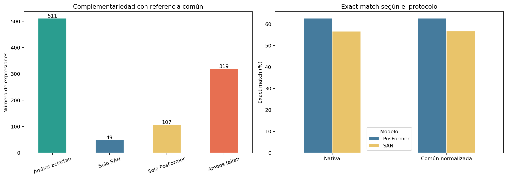
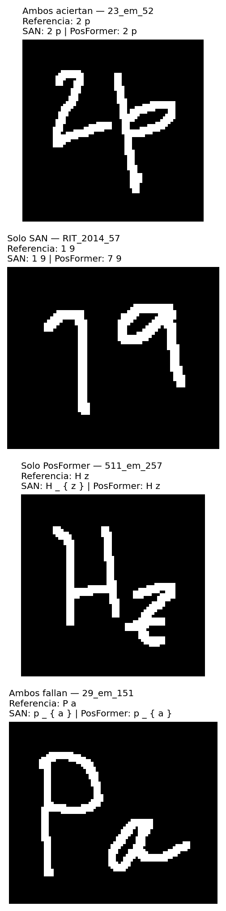

# Resumen de resultados: SAN vs. PosFormer en CROHME 2014

## Alcance

Se evaluaron SAN y PosFormer sobre las mismas 986 imágenes del test CROHME 2014. Las muestras se alinearon por identificador y se utilizó una única imagen por expresión. Cada modelo conservó su propio preprocesamiento.

El análisis contiene dos protocolos:

1. **Evaluación nativa:** SAN se compara con las etiquetas de Modelo1 y PosFormer con las de Modelo2.
2. **Evaluación común normalizada:** las dos predicciones se comparan con la etiqueta de Modelo2, adoptada como referencia canónica, después de normalizar espacios y eliminar el token `\limits`.

La evaluación común normalizada es la utilizada para medir la complementariedad entre los modelos.

## Validación de la ejecución

| Indicador | Resultado |
|---|---:|
| Muestras solicitadas | 986 |
| Muestras válidas | 986 |
| Errores de ejecución | 0 |
| Anotaciones diferentes entre Modelo1 y Modelo2 | 85 |
| GPU | NVIDIA GeForce RTX 4050 Laptop GPU |
| Python | 3.8.10 |
| PyTorch | 2.0.1+cu118 |

## Exact match por modelo

| Protocolo | SAN | PosFormer |
|---|---:|---:|
| Evaluación nativa | 558/986 (56.59 %) | 618/986 (62.68 %) |
| Referencia común normalizada | 560/986 (56.80 %) | 618/986 (62.68 %) |

PosFormer obtuvo el mayor exact match individual bajo los dos protocolos. Al adoptar la referencia común y eliminar `\limits`, SAN recuperó dos expresiones: pasó de 558 a 560 aciertos. El resultado de PosFormer no cambió.

## Complementariedad con referencia común normalizada

| Resultado | Instancias | Porcentaje |
|---|---:|---:|
| Ambos aciertan | 511 | 51.83 % |
| Solo SAN acierta | 49 | 4.97 % |
| Solo PosFormer acierta | 107 | 10.85 % |
| Ambos fallan | 319 | 32.35 % |
| **Total** | **986** | **100.00 %** |

Los dos modelos produjeron el mismo estado de acierto o error en 830 expresiones (84.18 %): 511 aciertos compartidos y 319 fallos compartidos. En las 156 expresiones restantes (15.82 %) solamente uno de los modelos acertó.

PosFormer aportó 107 aciertos exclusivos, más del doble de los 49 aportados exclusivamente por SAN. No obstante, los aciertos exclusivos de SAN demuestran que PosFormer no domina completamente al modelo más pequeño y que existe complementariedad aprovechable.

## Límite superior del oráculo

Un oráculo que seleccionara la predicción correcta siempre que al menos uno de los modelos acertara alcanzaría:

| Sistema | Aciertos | Exact match |
|---|---:|---:|
| SAN | 560 | 56.80 % |
| PosFormer | 618 | 62.68 % |
| Oráculo SAN + PosFormer | 667 | 67.65 % |

El oráculo mejora a PosFormer en 49 expresiones, equivalentes a **4.97 puntos porcentuales**. Frente a SAN, la mejora es de 107 expresiones o **10.85 puntos porcentuales**.

Otra forma de expresar la complementariedad es mediante la recuperación de errores:

- PosFormer resuelve 107 de las 426 expresiones que SAN falla: **25.12 %**.
- SAN resuelve 49 de las 368 expresiones que PosFormer falla: **13.32 %**.

El 67.65 % representa un límite superior teórico basado en conocer de antemano qué predicción es correcta. No corresponde al rendimiento directo de una cascada implementable, pues un sistema real necesita un mecanismo de selección o *gate*.

## Efecto de la normalización

| Resultado nativo | Resultado común normalizado | Instancias |
|---|---|---:|
| Ambos aciertan | Ambos aciertan | 509 |
| Solo PosFormer | Ambos aciertan | 2 |
| Solo PosFormer | Solo PosFormer | 107 |
| Solo SAN | Solo SAN | 49 |
| Ambos fallan | Ambos fallan | 319 |

Solamente dos instancias cambiaron de categoría. En ambas, la evaluación nativa indicaba que solo PosFormer acertaba, mientras que la evaluación común reconoció también como correcta la predicción de SAN. Esto explica el incremento de SAN de 558 a 560 aciertos.

La normalización aplicada fue deliberadamente conservadora: únicamente normalizó espacios y eliminó `\limits`. No se intentó convertir automáticamente otras construcciones LaTeX equivalentes. En los seis casos cuya diferencia entre Modelo1 y Modelo2 no se explica solamente por `\limits`, se conservó la etiqueta de Modelo2 como referencia canónica.

## Tiempos auxiliares de esta ejecución

| Modelo | Media | Mediana | P95 | Mínimo | Máximo | Inferencia acumulada |
|---|---:|---:|---:|---:|---:|---:|
| SAN | 103.45 ms | 102.71 ms | 183.76 ms | 18.17 ms | 428.85 ms | 102.00 s (1.70 min) |
| PosFormer | 364.24 ms | 227.97 ms | 775.40 ms | 60.22 ms | 53,688.89 ms | 359.14 s (5.99 min) |

Estos tiempos se registraron como información auxiliar durante la comparación pareada. No sustituyen los benchmarks individuales: no incluyen lectura de imágenes ni preprocesamiento en CPU y la ejecución mantuvo ambos modelos cargados simultáneamente. La media de PosFormer también está influida por una inferencia atípica de aproximadamente 53.69 segundos, por lo que la mediana describe mejor su tiempo típico en esta corrida.

## Conclusiones

1. PosFormer presenta el mejor exact match individual: 62.68 %, frente a 56.80 % de SAN bajo la referencia común.
2. Los modelos coinciden en su estado de acierto o error en 84.18 % del test.
3. Existe complementariedad en 156 expresiones; PosFormer aporta 107 aciertos exclusivos y SAN aporta 49.
4. La combinación ideal de ambos modelos tendría un límite superior de 67.65 %, 4.97 puntos por encima de PosFormer.
5. Los 319 fallos compartidos, equivalentes al 32.35 % del test, no pueden resolverse eligiendo entre estas dos predicciones.
6. La normalización de la referencia modifica poco el resultado global, pero evita penalizar dos predicciones correctas de SAN por diferencias de convención.

## Archivos relacionados

- Notebook: [`comparacion_san_posformer_crohme_2014.ipynb`](comparacion_san_posformer_crohme_2014.ipynb)
- Resultados por expresión: [`resultados/comparacion_san_posformer_crohme_2014.csv`](resultados/comparacion_san_posformer_crohme_2014.csv)
- Resumen estructurado: [`resultados/resumen_comparacion_san_posformer_crohme_2014.json`](resultados/resumen_comparacion_san_posformer_crohme_2014.json)
- Gráfica comparativa: [`resultados/comparacion_san_posformer_crohme_2014.png`](resultados/comparacion_san_posformer_crohme_2014.png)
- Ejemplos visuales: [`resultados/ejemplos_comparacion_san_posformer_crohme_2014.png`](resultados/ejemplos_comparacion_san_posformer_crohme_2014.png)

